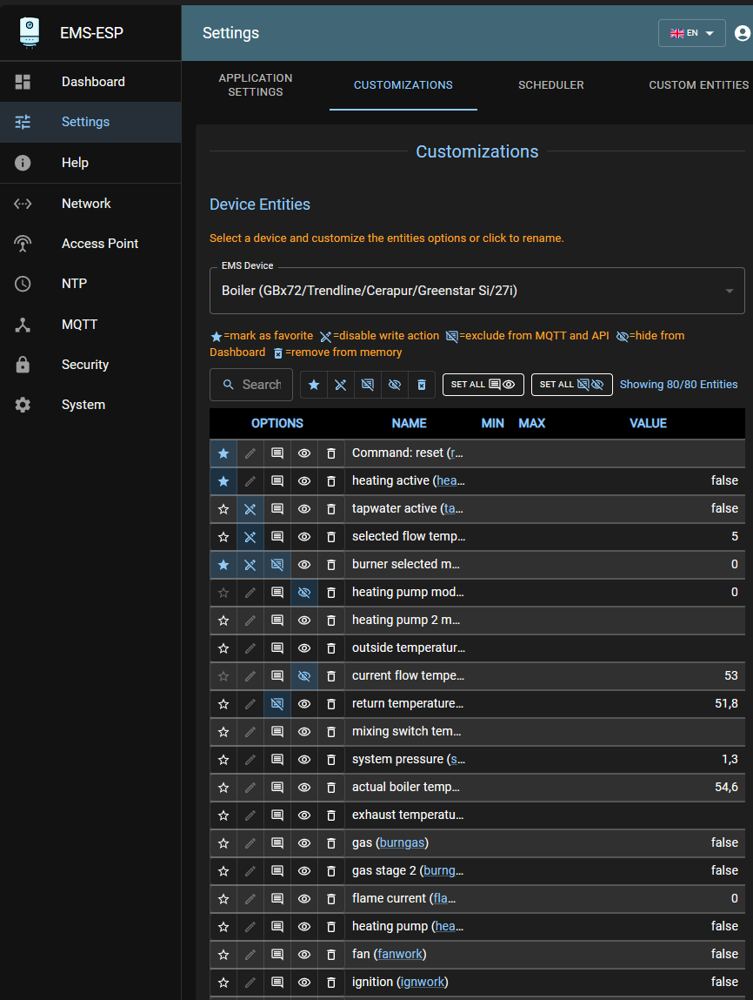

## First-time Configuration

- During the power-on sequence you'll see a sequence of LED flashes:
  - 1 flash means the EMS bus is not connected
  - 2 flashes means the network (wifi or ethernet) is not connected
  - 3 flashes means both EMS bus and network are failing. This is a critical error!
- A steady light indicates a good connection and EMS data is flowing in. A slow pulse can mean either the WiFi or the EMS bus are not connected yet. A very fast pulse is when the system is booting up and configuring itself which can typically takes a few seconds.
- Connect to the Access Point called `ems-esp` using the default WPA password `ems-esp-neo`. When you see the captive portal sign-in with username `admin` and password `admin`. Set the WiFi credentials and go back to <http://ems-esp>. Remember to change the password!
- First thing to check is if Tx is working and that you have a connection to the EMS bus. If Tx failures are shown in the Web interface try changing the Tx Mode from the settings page. There is no need to re-start the EMS-ESP.
- If Rx incomplete telegrams are reported in the log, don't panic. Some telegrams can be missed and this is usually caused by noise interference on the line.

Use the Web UI (<http://ems-esp> or <http://ems-esp.local>) to further configure the settings.

## EMS-ESP Settings

In the `Settings` section you'll find:

### Board Profile

- Choose from a pre-configured board or select `Custom` to see and change the hardware settings:
  - **Rx GPIO** - Which pin the Rx is assigned to. It can be any pin.
  - **Tx GPIO** - Which pin the Tx is assigned to. It can be any pin.
  - **Button GPIO**. Set a pin with pull-up. The button is used for different functions, such as holding for 10 seconds to reset to factory settings.
  - **Dallas GPIO**. This is the pin where any external temperature sensors are attached. The Dallas chips DS1822, DS18S20, DS18B20, DS1825 are supported including their parasite varieties and can also be daisy-chained onto a single line, up to 100 sensors.
  - **LED GPIO**. This is the pin for the LED, defaulted to the onboard LED on the ESP dev board.
  - And a set of Ethernet settings for advanced tweakers

### EMS Bus

- **Tx Mode**. Choose the mode that works best for your system and watch for Tx errors in the Web Dashboard and `show ems` in the Console. Changing the value has immediate effect.
  - `EMS` is the default for EMS1.0 systems but also compatible with most other bus protocols.
  - `EMS+` is designed to work better for EMS2.0/EMS+ systems.
  - `HT3` for Heatronics3 used primarily by Junkers.
  - `Hardware` uses the internal ESP's hardware to send out the telegram. Telegrams are sent immediately. It is the fastest and most efficient method but works only on some systems.
- **Bus ID**. The EMS-ESP can simulate one of 5 devices. Stick to the `Service Key (0x0B)` unless using multiple EMS gateways or interfaces.

### General Options

- **Hide LED**. Turns off the LED when in normal operating mode. The LED is still shown when booting or when there are connection issues.
- **Enable Telnet Console**. This is on by default and allows users to connect to the in-secure Telnet server on port 23.
- **Enable Analog Sensors**. This enables any GPIO to collect signals, whether it's a digital I/O, a pulse counter or ADC measuring mv.
- **Convert temperature values to Fahrenheit**. For our US friends.
- **Underclock CPU speed**. Under-clocks the ESP to 160Mhz, saving on power, heat and prolonging the lifespan of the chip at the cost of performance and response time. A reboot of EMS-ESP is required.
- **Bypass Access Token authorization on API calls**. For RESTful write commands via HTTP POST the access token is required. This is for security reasons to prevent anyone changing device settings. Setting this flag makes the API open. Not recommended!
- **Enable Read only mode**. This disables any outgoing Tx write commands to the EMS bus, essentially putting EMS-ESP into listening mode.
- **Enable Shower Timer**. Enable to time how long the hot water runs for and it will send out an MQTT message with the duration. The timer starts after a minimal of 2 minutes running time.
- **Enable Shower Alert**. This is experimental and may not work on all systems. After 7 minutes running hot water, send out a warning by 3 short bursts of cold water.

### Formatting Options

- **Boolean Format**. This is how boolean values are displayed in the Web UI and MQTT payloads.
- **Enum Format**. This is how list values are presented in the MQTT payloads, either by it's value or the index position within the list.

### Temperature Sensors

- **Use Dallas Sensor parasite power**. Select this option when using (Dallas) temperature sensors with parasitic power.

### Logging

- **Log EMS telegrams in hexadecimal** will write the telegrams in raw format as hexadecimal values everywhere.

For Syslog:

- **IP** is the IP address of a syslog server for capturing remote logs. Leave blank is not using SysLog.
- **Port** if using an alternate port number. The default is 514.
- **Log Level** sets the maximum log level for reported messages. The highest level is DEBUG which will send a lot of log data so use with caution.
- **Mark Interval** will send out a special `mark` message to the SysLog. This is useful for timing events.

## MQTT Settings

These settings can be found in the `MQTT` tab on the Web UI. Most are self-explanatory.

- **Client ID**. This is used internally to identify EMS-ESP with the broker and is optional. Note MQTT topics will be postfixed with the hostname (default `ems-esp`) and not the client ID.
- **Base**. All topics are prefixed with `Base`, which is defaulted to `ems-esp` and can be changed to an individual path.
- **Set Clean Session**. Creates a non-persistent session when enabled.
- **QoS**. Quality of Service, 0, 1 or 2. 0 is the default and suitable for more scenarios. 1 will give a guarantee that the message has been sent, but will create slightly more traffic and overhead.
- **Always use Retain Flag**. Enable if you want to persist all the messages on the broker. Default is off.
- **Formatting**. The `Single` option will send all data as separate topics, `Nested` will group the data into one JSON payload.
- **Publish command output to a 'response' topic'**. This takes the output from an API command (e.g. read) and publishes the result in a topic called `response`.
- **Publish single value topics on change**. This option will immediately publish the topic and payload for each operation.
- **Enable MQTT Discovery**. Enables the integration with Home Assistant and Domoticz.
- **Publish Intervals**
  - This section is per device and sets how frequent an MQTT message is sent. When set to 0 EMS-ESP will send data automatically when there is a noticeable change, which could be within a few seconds.

## Adding external sensors

External sensors, like temperature and analog sensors can be attached to a range of GPIO pins on the ESP32 chip. If using a BBQKees gateway board it already has an external plug for Dallas temperature sensors which will be visible in the Web UI without any configuration.

To add custom sensors click on the + and choose between a normal Digital in/out, a Counter (counting on/off pulses) or ADC for measuring voltages.

> [!WARNING] Be careful when picking a GPIO so it doesn't clash with the other used GPIOs (you can select CUSTOM board profile to view your current configuration).
> Ems-esp is connected to the low voltage bus of your heating and overvoltage can damage ems-esp and your heating. Do not power external equipment from ems-esp.

The following GPIOs are recommended:

- digital output: 13, 19, 21, 22, 27, 33, 37, 38
- digital input/counter/timer/rate: 13, 19, 21, 22, 25, 26, 27, 33, 35, 37, 38, 39 (note no pullup on 35 & 39)
- ADC input: 13, 19, 21, 22, 25, 26, 27, 33, 35, 37, 38, 39
- DAC output: 25, 26
- PWM output: 13, 19, 21, 22, 25, 26, 27, 33, 37, 38

Limits:

- ADC: 1.5V
- DAC 8bit
- PWM: max. frequency 5000Hz, resolution 13bits
- Counter/timer/rate trigger on high->low edge with 15 ms debounce. Only for low pulserates.

## Customization

This page shows all registered entities and allows to exclude commands and values from publishing via mqtt/api or remove them from dashboard. The dashboard only shows entities with values, the customization page shows all. If an entity has no value then it is supported by ems-esp, but not by your boiler/thermostat/etc.

