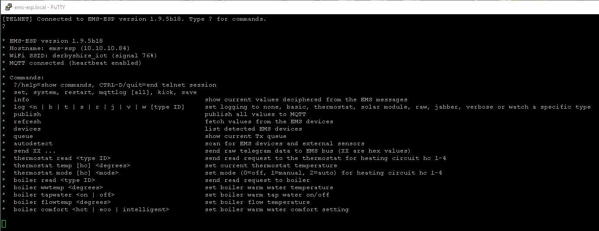
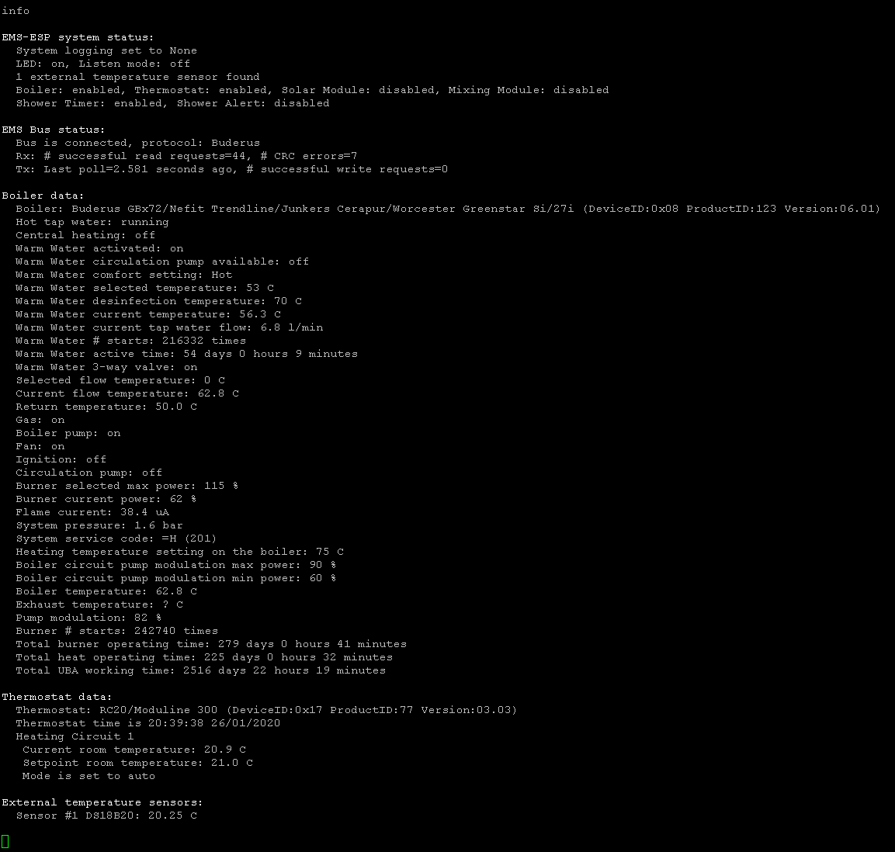

## Using Telnet to monitor EMS traffic

EMS-ESP has a telnet server that enables clients to connect using a telnet client such as [CoolTerm](http://freeware.the-meiers.org/), [PuTTY](https://www.chiark.greenend.org.uk/~sgtatham/putty/latest.html) or natively via the OS like this example with [Windows 10](https://www.technipages.com/windows-10-enable-telnet).

Connect to the IP address of the EMS-ESP. Type `?` or `help` to see a list of commands:



By default logging to the console is disabled. There are different levels of logging with "verbose" giving you all the real-time data of telegrams and any messages or warnings. Type `log v` and enable verbose logging and you'll see something similar too:


To view the current status of the EMS bus and all its captured values use the `info` command:



> **Warning: be careful when sending values to the boiler. If in doubt you can always reset the boiler to its original factory settings by following the instructions in the user guide. For example on my Nefit Trendline that is done by holding down the Home and Menu buttons simultaneously for a few seconds, selecting factory settings from the scroll menu followed by pressing the Reset button.**

### Recommended puTTY settings

The Telnet code handles continuous motioning of key strokes, which is useful when monitoring a stream of incoming telegrams and issuing commands at the same time. If you're using puTTY then this will be need to be enabled. I suggest the following settings:

```
Terminal->Local line editing->Force off
Terminal->Bell->None
Window->Columns: 180
Window->Rows: 70
Window->Lines of scrollback: 5000
Window->Appearance->Font quality: Antialiased
```


