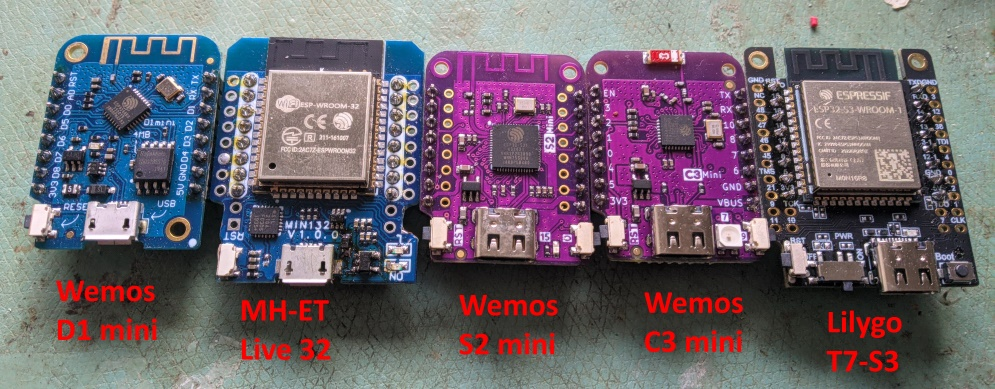
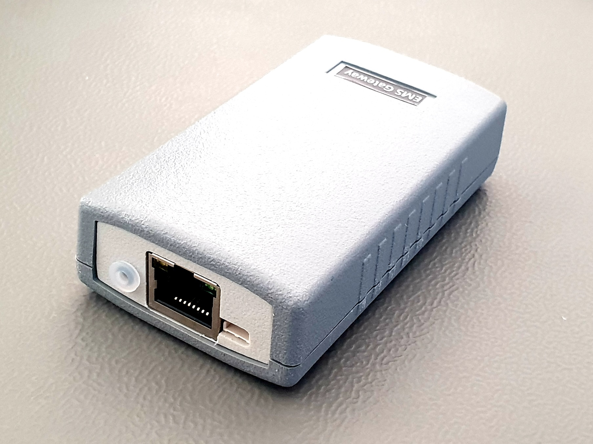

description: Getting started with EMS-ESP. What you need, how to install and do initial configuration.

## Prerequisites

### Needed Hardware

#### ESP32 development board

The EMS-ESP firmware runs on an ESP32 module from [Espressif](https://www.espressif.com/en/products/socs). Go to the GitHub discussion [here](https://github.com/emsesp/EMS-ESP32/discussions/839#discussioncomment-4493156) to see which ESP32 board are currently supported.

</img>

#### EMS Interface board

</img>
EMS-ESP also requires a separate circuit to read and write to the EMS bus. You can either build your own or purchase an [interface board](https://bbqkees-electronics.nl/product/ems-interface-board-v3/) from BBQKees or what is highly recommended is to buy an all-in-one [EMS Gateway](https://bbqkees-electronics.nl/shop/) from BBQKees that comes pre-installed and tested with the latest version of EMS-ESP.

## Uploading the firmware

The firmware is a single binary `.bin` file. First decide whether you want to take the [current stable version](https://github.com/emsesp/EMS-ESP32/releases/latest) or risk it and take the [latest development version](https://github.com/emsesp/EMS-ESP32/releases/tag/latest) to have the latest features and of course any possible issues.

Make sure you pick the right firmare .bin file for your ESP32. The format for the file is

`EMS-ESP-<version>-<chip type>-<flash mem>[+].bin`

The `chip type` is as defined in esp_platform from pio (Platform IO). This can be ESP32, ESP32S3, ESP32C3 etc. All uppercase.

`flash mem` is the Flash memory size and is either 4MB or 16MB.

`+` is added at the end if there the module is expected to have PSRAM on board.

!!! warning "Pay attention to the [Change Log](Version-Release-History) before upgrading for any breaking changes"

### BBQKees Electronics EMS Gateway

Use this table to help you decide which firmware to use when using a BBQKees Electronics EMS Gateway.

| Model                 | Year          | Chip     | Flash size | PSRAM | file ending        |
| --------------------- | ------------- | -------- | ---------- | ----- | ------------------ |
| Gateway E32 V2        | >01-2024      | ESP32    | 16MB       | 8MB   | -ESP32-16MB+.bin   |
| Gateway S3(-LR)       | >09-2023      | ESP32-S3 | 16MB       | 8MB   | -ESP32S3-16MB+.bin |
| Gateway E32 V1.5      | >12-21 <06-23 | ESP32    | 4MB        | no    | -ESP32-4MB.bin     |
| Gateway E32 V1.0/V1.4 | >04-21 <12-21 | ESP32    | 4MB        | no    | -ESP32-4MB.bin     |
| Gateway S32 V2        | >02-22 <01-23 | ESP32    | 16MB       | no    | -ESP32-16MB.bin    |
| Gateway S32 V1        | >02-21 <02-22 | ESP32    | 4MB        | no    | -ESP32-4MB.bin     |

### First time install

If this is a fresh install you will need to upload it manually and there are two methods for this.

1. via the browser by visiting [https://install.emsesp.org](https://install.emsesp.org).
1. using the [EMS-ESP Flasher tool](https://github.com/emsesp/EMS-ESP-Flasher/releases). The are versions for Windows, Linux and Mac OSX. Note you may see a security vulnerability warning on Windows which you can safely ignore.
1. using the PlatformIO CLI like `pio run -e <target> -t upload`

### Upgrading from a previous release

If you are upgrading from a previous release it's recommended you perform the upgrade directly via the WebUI (`Settings>Download/Upload`).

!!! note "There was an issue with older BBQKees Gateway boards that used a smaller partition size on the ESP32. If you're upgrading from v3.4 or earlier and have one of these boards then make a backup of your settings and use the [EMS-ESP Flasher tool](https://github.com/emsesp/EMS-ESP-Flasher/releases)."

## What the onboard LED is telling you

!!! info

    During the power-on sequence you'll see a sequence of LED flashes:

    * 1 x flash = the EMS bus is not connected

    * 2 x flash = the network (wifi or ethernet) is not connected

    * 3 x flash = both EMS bus and network are failing. This is a critical error!

    During normal operation the LED displays the current status:

    * A steady solid light indicates a good connection and EMS data is flowing in

    * A slow pulse can mean either the WiFi or the EMS bus are not connected yet

    * A very fast pulse is when the system is booting up and configuring itself which can typically takes a few seconds
