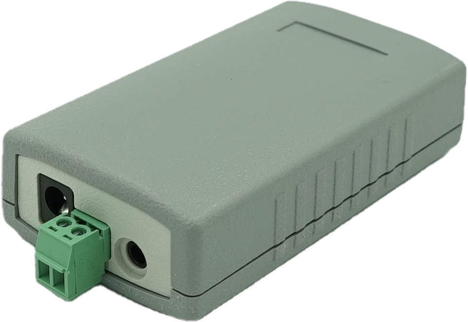
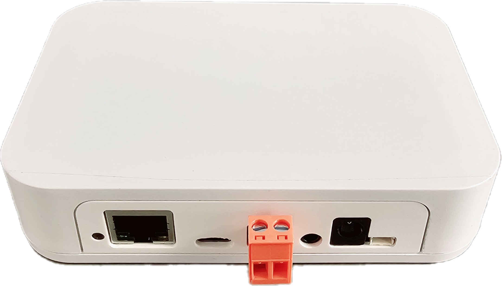

  
📦

  <h1 style="margin: 0; color: var(--md-default-fg-color);">Installation Guide</h1>
  

    Everything you need to get EMS-ESP up and running
  

  <h2 style="color: var(--md-default-fg-color);">🔧 Required Hardware</h2>
  
  

    

      

        
🔌

        <h3 style="margin: 0; color: var(--md-default-fg-color);">ESP32 Development Board</h3>
      

      

        The EMS-ESP firmware runs on an ESP32 module from <a href="https://www.espressif.com/en/products/socs" style="color: #007bff;">Espressif</a>. The chipsets ESP32-S, ESP32-S2, ESP32-S3 and ESP32-C3 are supported.
      

      

        See the post <a href="https://github.com/emsesp/EMS-ESP32/discussions/839#discussioncomment-4493156" style="color: #007bff;">here</a> on which development boards we have tested against.
      

      

        
      

    

    

      

        
🔗

        <h3 style="margin: 0; color: var(--md-default-fg-color);">EMS Interface Board</h3>
      

      

        EMS-ESP also requires a separate circuit to read and write to the EMS bus. You can either <a href="EMS-Circuit" style="color: #007bff;">build your own</a> or purchase a EMS Gateway board directly from BBQKees Electronics.
      

      

        
        
      

      

        <a href="https://bbqkees-electronics.nl" style="display: inline-block; padding: 0.8rem 1.5rem; background: #28a745; color: white; text-decoration: none; border-radius: 5px; font-weight: bold;">Visit BBQKees Electronics</a>
      

    

  

  <h2 style="color: var(--md-default-fg-color);">🚀 Installing EMS-ESP</h2>
  
  

    

      <h3 style="margin-top: 0; color: var(--md-default-fg-color);">📥 Download & Install</h3>
      

        Click the link below to go to the download page and see the multiple methods available to install the firmware onto your ESP32 board.
      

      <a href="https://download.emsesp.org" style="display: inline-block; padding: 1rem 2rem; background: #007bff; color: white; text-decoration: none; border-radius: 8px; font-weight: bold; font-size: 1.1rem; box-shadow: 0 4px 6px rgba(0,0,0,0.1);">Install Firmware</a>
    

  

  
  

    

      <h4 style="margin-top: 0; color: #e0a800;">⚠️ Important Notice</h4>
      

        Pay attention to the <a href="Version-Release-History" style="color: #007bff;">Change Log</a> before upgrading so you are aware of any breaking changes.
      

    

    

      <h4 style="margin-top: 0; color: #17a2b8;">💾 Backup Recommendation</h4>
      

        If you are upgrading from a previous release it's recommended you make a backup copy of any settings and configurations before performing the installation. This can be done from the WebUI Settings page 'Download/Upload'.
      

    

  

  <h2 style="color: var(--md-default-fg-color);">💡 LED Status Indicators</h2>
  

    When EMS-ESP starts-up and is running, the onboard LED will show the system status.
  

  
  

    <h3 style="color: var(--md-default-fg-color);">🔄 During Boot Sequence</h3>

    

      

        

          

          <h4 style="margin: 0; color: #dc3545;">1 Flash</h4>
        

        

          EMS bus is not yet connected. If this takes more than a few seconds check the EMS Tx Mode and the physical connection to the EMS bus.
        

      

      
      

        

          

          

          <h4 style="margin: 0; color: #e0a800;">2 Flashes</h4>
        

        

          Network (WiFi or Ethernet) is connecting. If this persists check the EMS-ESP Network settings. EMS-ESP uses 2.4GHz/WPA2 only.
        

      

      
      

        

          

          

          

          <h4 style="margin: 0; color: #6f42c1;">3 Flashes</h4>
        

        

          Both the EMS bus and Network are still trying to connect. This could be due to an incorrect EMS-ESP Board Profile setting.
        

      

    

  

  
  

    <h3 style="color: var(--md-default-fg-color);">✨ During Normal Operation</h3>
    

      Unless the LED has been disabled in the settings, the LED will show the system status.
    

    

      

        

          

          <h4 style="margin: 0; color: #28a745;">Steady Light</h4>
        

        

          Good connection and EMS data is flowing in.
        

      

      
      

        

          

          <h4 style="margin: 0; color: #e0a800;">Slow Pulse</h4>
        

        

          Either the WiFi or the EMS bus are still connecting.
        

      

      
      

        

          

          <h4 style="margin: 0; color: #17a2b8;">Fast Pulse</h4>
        

        

          System is booting up and configuring itself.
        

      

    

  

