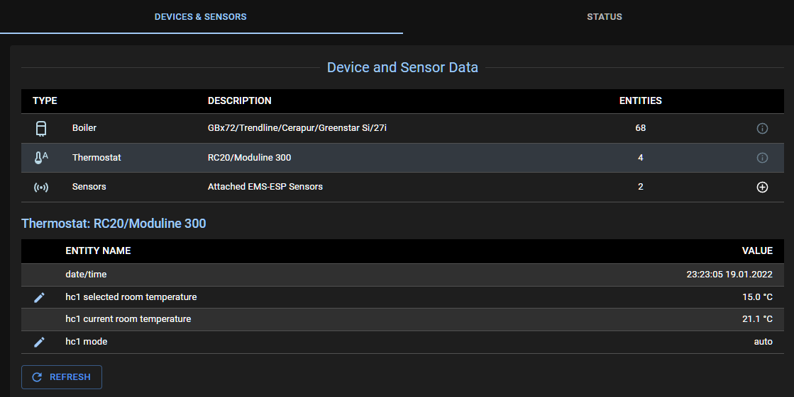
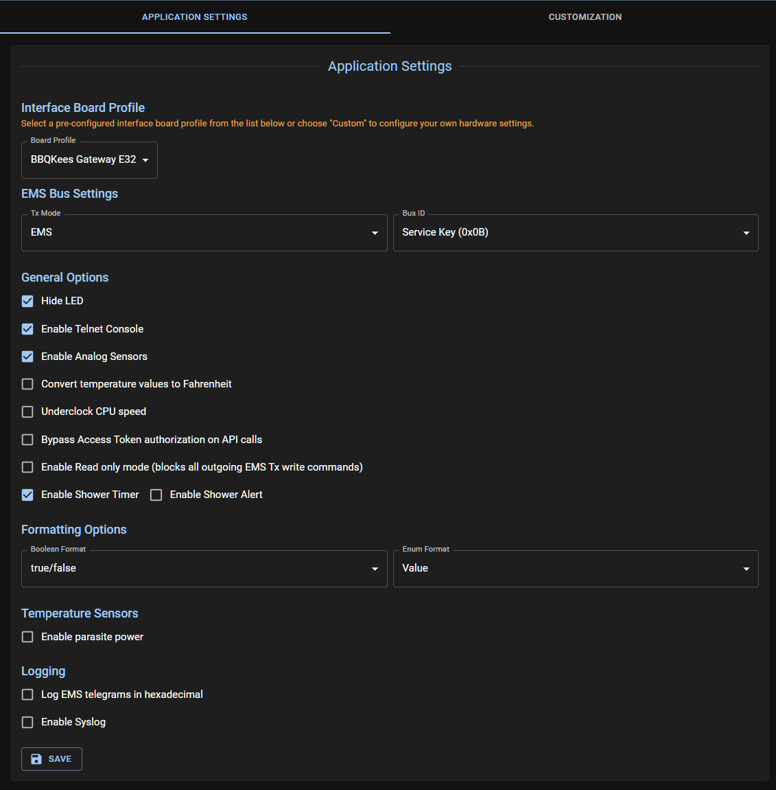
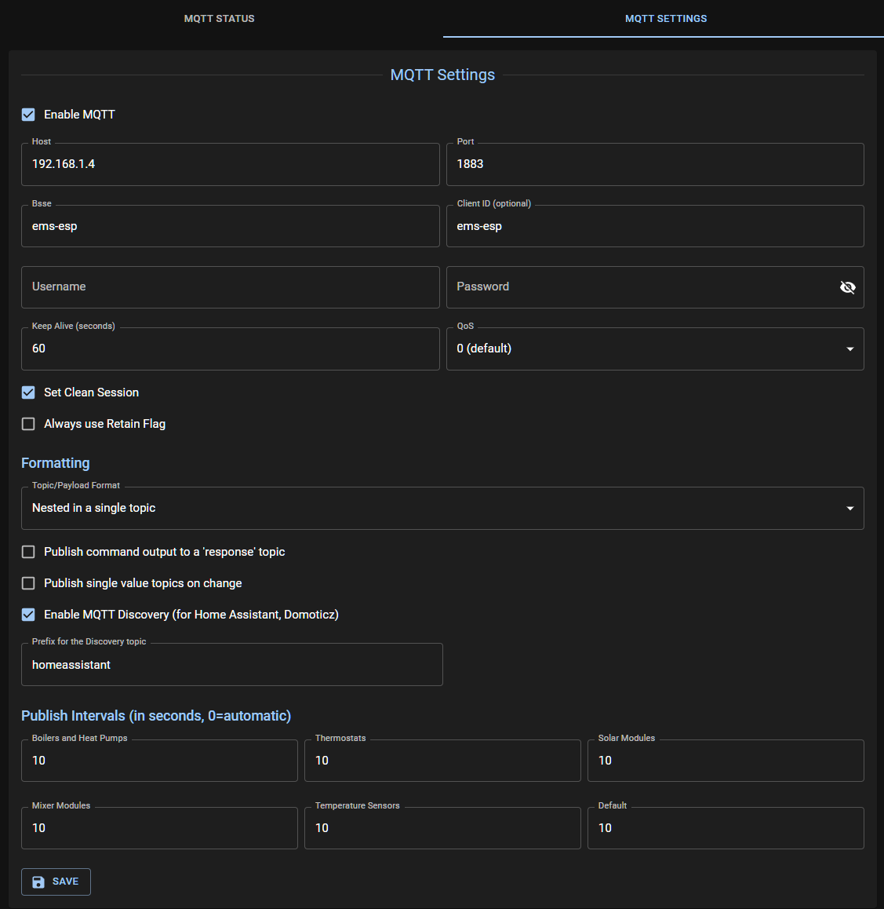

  
🌐

  <h1 style="margin: 0; color: var(--md-default-fg-color);">Web Interface</h1>
  

    Access your EMS-ESP device through the modern web interface
  

  <h3 style="margin-top: 0; color: var(--md-default-fg-color);">🔗 Accessing the WebUI</h3>
  

    Access the WebUI via <code style="background: var(--md-code-bg); padding: 0.2rem 0.4rem; border-radius: 3px; color: var(--md-code-fg);">http://ems-esp</code> or <code style="background: var(--md-code-bg); padding: 0.2rem 0.4rem; border-radius: 3px; color: var(--md-code-fg);">http://ems-esp.local</code>. The <code style="background: var(--md-code-bg); padding: 0.2rem 0.4rem; border-radius: 3px; color: var(--md-code-fg);">ems-esp</code> is the name of the WiFi hostname as defined in the WiFi Settings page.
  

  <h2 style="text-align: center; margin-bottom: 2rem; color: var(--md-default-fg-color);">📱 Interface Screenshots</h2>
  
  

    

      <h4 style="margin-top: 0; color: var(--md-default-fg-color);">📊 Status Dashboard</h4>
      
Monitor your EMS system status and real-time data

      
    

    

      <h4 style="margin-top: 0; color: var(--md-default-fg-color);">🔧 Device Management</h4>
      
Configure and manage your EMS devices

      
    

    

      <h4 style="margin-top: 0; color: var(--md-default-fg-color);">⚙️ System Settings</h4>
      
Configure system parameters and preferences

      
    

    

      <h4 style="margin-top: 0; color: var(--md-default-fg-color);">📡 MQTT Configuration</h4>
      
Set up MQTT broker connection and topics

      
    

  

  <h2 style="text-align: center; margin-bottom: 2rem; color: var(--md-default-fg-color);">✨ WebUI Features</h2>
  
  

    

      <h4 style="margin-top: 0; color: #007bff;">📊 Real-time Monitoring</h4>
      <ul style="margin: 0; padding-left: 1.2rem; color: var(--md-default-fg-color);">
        <li>Live data updates</li>
        <li>System status overview</li>
        <li>Device health monitoring</li>
      </ul>
    

    

      <h4 style="margin-top: 0; color: #28a745;">🔧 Easy Configuration</h4>
      <ul style="margin: 0; padding-left: 1.2rem; color: var(--md-default-fg-color);">
        <li>Intuitive settings interface</li>
        <li>Device management tools</li>
        <li>Network configuration</li>
      </ul>
    

    

      <h4 style="margin-top: 0; color: #e0a800;">🌐 Multi-language Support</h4>
      <ul style="margin: 0; padding-left: 1.2rem; color: var(--md-default-fg-color);">
        <li>11 supported languages</li>
        <li>Localized interface</li>
        <li>Customizable labels</li>
      </ul>
    

    

      <h4 style="margin-top: 0; color: #dc3545;">📱 Responsive Design</h4>
      <ul style="margin: 0; padding-left: 1.2rem; color: var(--md-default-fg-color);">
        <li>Mobile-friendly interface</li>
        <li>Tablet optimization</li>
        <li>Desktop compatibility</li>
      </ul>
    

  

  <h3 style="margin-top: 0; color: var(--md-default-fg-color);">🚀 Quick Start</h3>
  

    

      
1️⃣

      <h4 style="margin: 0; color: var(--md-default-fg-color);">Connect</h4>
      
Access via http://ems-esp

    

    

      
2️⃣

      <h4 style="margin: 0; color: var(--md-default-fg-color);">Configure</h4>
      
Set up your devices

    

    

      
3️⃣

      <h4 style="margin: 0; color: var(--md-default-fg-color);">Monitor</h4>
      
Watch real-time data

    

  

