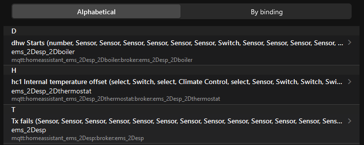

EMS-ESP can be integrated into openHab through different ways:

- HomeAssistant MQTT Components Binding (based on Home Assistent discovery protocol)
- MQTT Binding (Generic MQTT Thing)

TODO: Add SCREENS of CURRENT UI

!!! note "Documentation has been created for openHab version 3.x"

## HomeAssistant MQTT Components Binding
### Installation
EMS-ESP creates retained MQTT messages prefixed with `homeassistant/` for each device and their values (called entities) based on the Home Assistant (HA) Discovery protocol. To allow auto discovery in openHAB the [MQTT Binding](https://www.openhab.org/addons/bindings/mqtt/) and the [HomeAssistant MQTT Components Binding](https://www.openhab.org/addons/bindings/mqtt.homeassistant/) has to be installed. Additionally `JINJA` and `JSONPath` transformations are needed to map all entities and features. In EMS-ESP enable the Discovery option from the MQTT Settings page.

Objects in HA are mapped to `Things`, Component+Node to `ChannelGroup` and Component Features to `Channels`. More information can be found in the binding specification.

### Discovery
You should see based on your heating setup related `Things` in your Inbox


After adding the `Things` you can see all `Channels` that are available for the specific device and which you have enabled in EMS-ESP for MQTT. Example `Channels` of a thermostat


### Limitations
There are currently some limitations by using the binding. One of them is also affecting the integration of EMS-ESP into openHAB.
- The HomeAssistant Climate Components is not yet supported (you won´t find those `Channels` in the list)

It is possible that those entities will be supported in future depending on the further development of the binding.

## MQTT Binding (File based approach)
EMS-ESP offers all information via the base [**MQTT**](Commands#mqtt) path `ems-esp/` using topics and payloads that can be mapped to `Generic MQTT Things` and related `Channels`. 

### Installation
You need to install the [MQTT Binding](https://www.openhab.org/addons/bindings/mqtt/) as client for a MQTT broker and the [JSONPath Transformation Service](https://www.openhab.org/addons/transformations/jsonpath/) for selecting the specific channels in the provided JSON-structure of EMS-ESP.

### Generic MQTT Thing
It is possible to create for each device a seperate `Generic MQTT Thing` or all in just one. In the following a  example will be provided that can be adapted to your corresponding setup and you wishes.

```python title="mqtt.things"
Bridge mqtt:broker:broker "MQTT Bridge" [ host="127.0.0.1", secure=false ]{
    Thing topic ems-esp "Buderus Heating Pump" @ "gBoilerRoom" {
    Channels:
       Type switch : EMS_s_pvcooling "Cooling only with PV" [stateTopic="ems-esp/boiler_data", commandTopic="ems-esp/boiler/pvcooling", ON="ON", OFF="OFF", transformationPattern="JSONPATH:$.pvcooling"]
       Type number : EMS_n_pvraiseheat "Raise Hot Water with PV by" [stateTopic="ems-esp/thermostat_data", commandTopic="ems-esp/thermostat/pvraiseheat", transformationPattern="JSONPATH:$.pvraiseheat"]
       Type string : EMS_maxheatheat "Auxilliary Heater Limit Heating" [stateTopic="ems-esp/boiler_data", commandTopic="ems-esp/boiler/maxheatheat", transformationPattern="JSONPATH:$.maxheatheat"]
    }
}
```

### Items
```python title="ems-esp.items"
Switch           EMS_s_pvcooling
                 "Cooling only with PV"
                 <switch>
                 (gBoilerRoomHeatingHotWater)
                 ["Water", "Switch"]
                 {channel="mqtt:topic:broker:ems-esp:EMS_s_pvcooling"}

Number           EMS_n_pvraiseheat
                 "Raise Hot Water with PV by [%.1f K]"
                 <temperature>
                 (gBoilerRoomHeatingCircuit)
                 ["Setpoint","Temperature"]
                 {channel="mqtt:topic:broker:ems-esp:EMS_n_pvraiseheat", autoupdate="false", listWidget="oh-stepper-item"[min=0, max=5, step=1]}

String           EMS_maxheatheat
                 "Auxilliary Heater Limit Heating"
                 <heating>
                 (gBoilerRoomHeating)
                 ["Status", "Current"]
                 {channel="mqtt:topic:broker:ems-esp:EMS_maxheatheat", stateDescription=""[options="0=0 KW,1=2 kW,2=3 kW,3=4 kW,4=6 kW,5=9 kW"]}
```
### Sitemap (optional)
```python title="home.sitemap"
Frame label="Heating" {
    Switch item=EMS_s_pvcooling
    Slider item=EMS_n_pvraiseheat
    Selection item=EMS_maxheatheat
}
```

## MQTT Binding (UI based approach)
